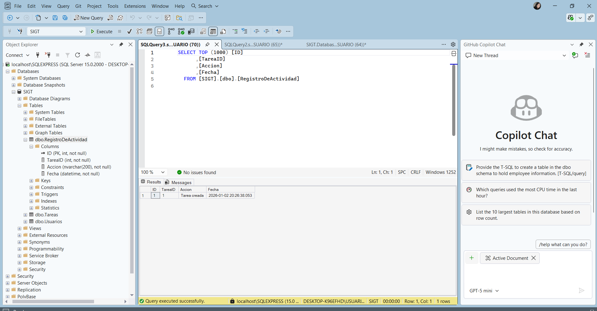
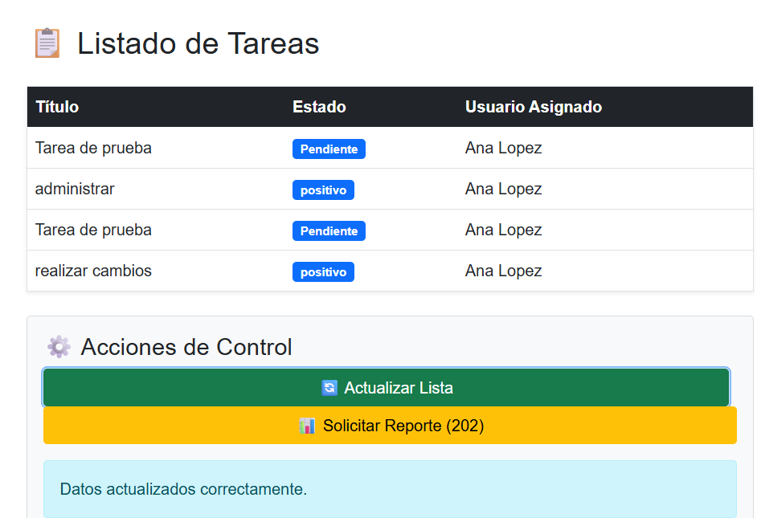
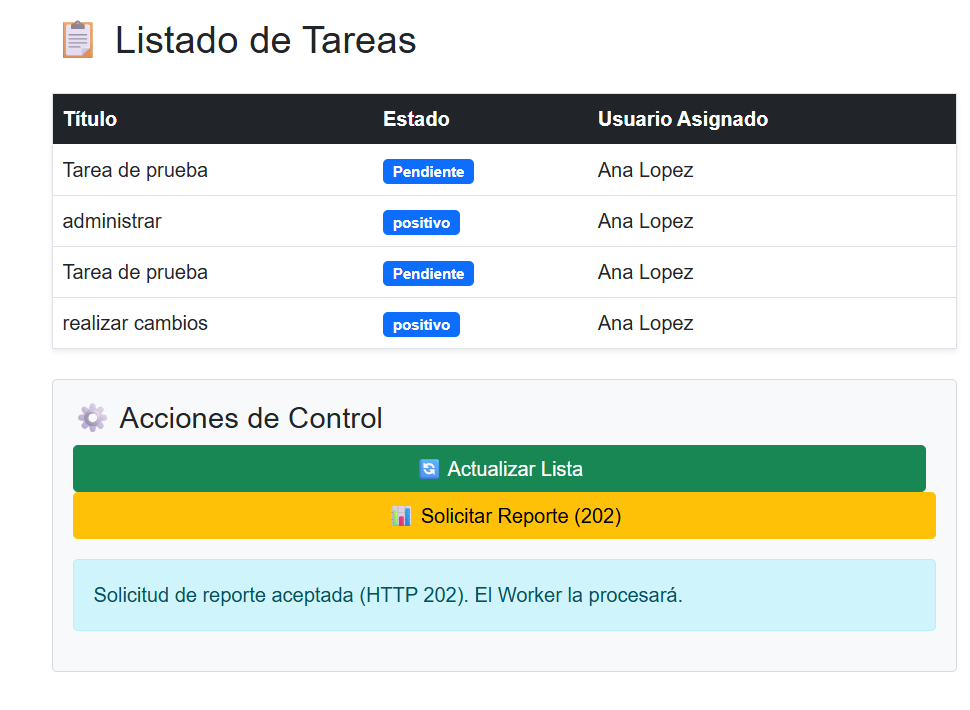

Batería de Pruebas: Evidencias de Funcionamiento
Para validar el cumplimiento de los requisitos técnicos, se realizaron las siguientes pruebas:

1. Persistencia y Seguridad (Base de Datos)
Acción: Crear una nueva tarea desde el formulario de Blazor o Swagger.

Resultado: La tarea se guarda correctamente en la tabla Tareas llamando al procedimiento almacenado sp_Tarea_Create.

Validación de Seguridad: Se comprobó que no hay sentencias INSERT directas en el código del repositorio, cumpliendo con la protección contra SQL Injection.

2. Automatización de Auditoría (Trigger)
Acción: Insertar un registro en la tabla Tareas.

Resultado: El disparador trg_Tareas_AfterInsert se activa automáticamente.

Evidencia: Al ejecutar SELECT * FROM RegistroDeActividad, aparece un nuevo registro con el ID de la tarea y la acción "Tarea creada".

3. Integración de Datos (Vistas)
Acción: Cargar el listado de tareas en el Frontend.

Resultado: La tabla muestra el nombre completo del usuario asignado.

Técnico: Se utiliza la vista vw_TareasConUsuario que realiza un INNER JOIN entre las tablas Tareas y Usuarios.

4. Resiliencia y Asincronía (Worker Service)
Acción: Ejecutar el proyecto SIGT.Worker.

Resultado: La consola imprime un log cada 30 segundos indicando que el servicio está activo.

Resiliencia: Se forzó un error de conexión y el bloque try-catch permitió que el servicio continuara operando sin cerrarse.

5. Comunicación HTTP (Protocolo 202)
Acción: Hacer clic en el botón "Solicitar Reporte" en Blazor.

Resultado: El servidor responde con un código 202 Accepted.

Significado: La API confirma que la petición es válida y se procesará de forma asíncrona por el Worker.
